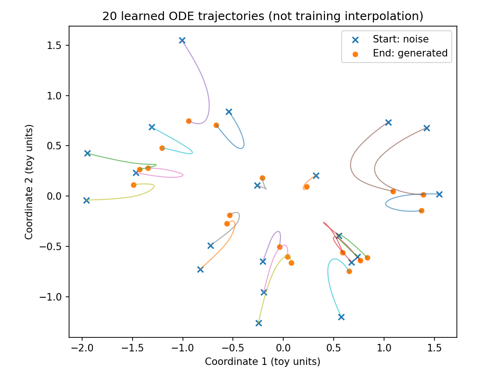
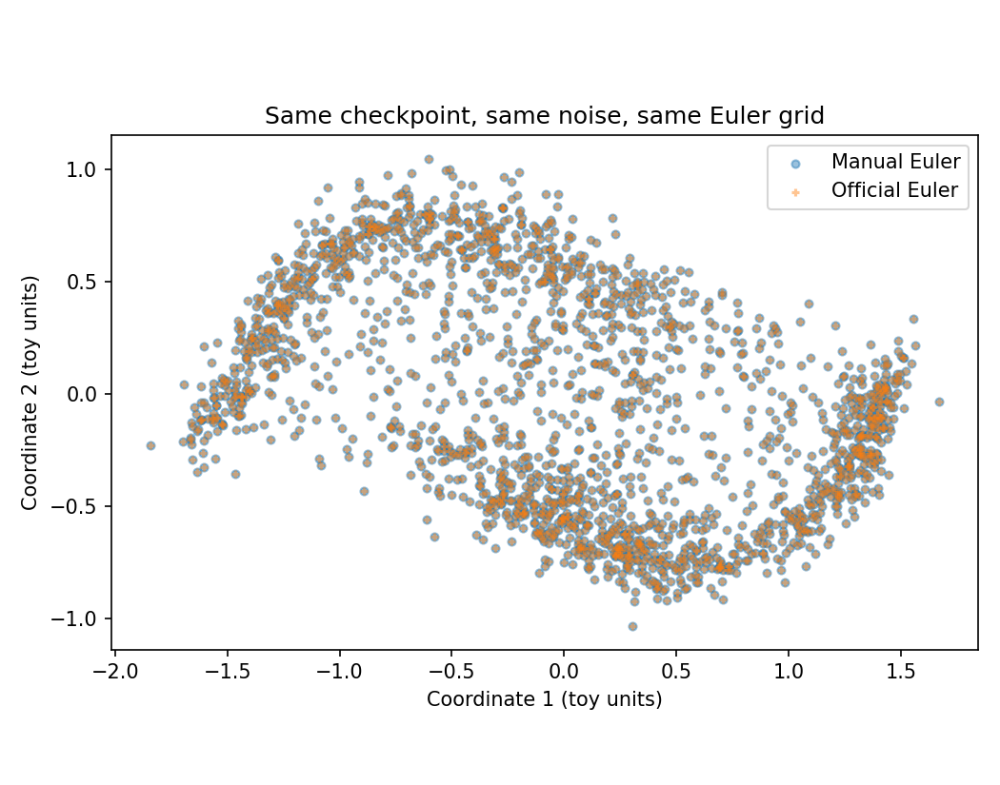

# 04 — Reproduction (two-moons + API check)

Primary run directory: local `Week3_Day3/outputs/day3/`.  
Reduced metrics: [`results/day3_metrics.json`](results/day3_metrics.json), [`results/day3_config.json`](results/day3_config.json).  
API-check extract: [`results/day4_checks.json`](results/day4_checks.json).

**Checkpoint weights are not copied into this note.** Identity is the SHA-256 below.

This is a teaching-scale generative run on a 2-D toy. It is not the Flow Matching paper’s CIFAR / ImageNet setup, and it is not a robot policy.

---

## 1. Environment

| Item | Cited runs |
|---|---|
| OS | recorded as `Windows-10-10.0.26200-SP0` |
| GPU | NVIDIA GeForce RTX 4060 Laptop |
| Python | 3.10.21 |
| PyTorch | 2.1.2+cu121 |
| NumPy | 1.26.4 |
| `flow_matching` | 1.0.10 for the API check, solver study, and conditional model. Two-moons training does not import it |
| `torchdiffeq` | 0.2.5 for those same three runs |
| Conda env | `flow` |

The two-moons script only needs `torch`, `numpy`, and `matplotlib`.

---

## 2. Data

`sample_two_moons`: angle $\sim U(0, \pi)$, a fair coin picks the lower or upper moon, then isotropic Gaussian jitter of scale `data_noise = 0.08`.

No download. Each training step draws a fresh batch. The 4096-point validation batch is drawn once and reused for the before/after CFM MSE. It is not a held-out robot log.

---

## 3. Training config

| Hyperparameter | Value |
|---|---|
| Steps | 5000 optimizer updates |
| Batch size | 256 |
| Hidden width | 128 |
| Layers | 3 × SiLU, then linear to $\mathbb{R}^2$ |
| Optimizer | Adam, lr $10^{-3}$, no scheduler |
| Seed | 42 |
| Device | CUDA (config requested `auto`) |
| Loss | mean squared error on $x_1 - x_0$ |

Sampling after training uses a **new** set of 2000 noise draws and **100** Euler steps. Training steps and integration steps are different counters. The before/after sample plots share one initial noise tensor.

---

## 4. Recorded metrics (local CUDA)

From [`results/day3_metrics.json`](results/day3_metrics.json):

| Quantity | Value |
|---|---|
| Validation CFM MSE before | 1.516425371170044 |
| Validation CFM MSE after | 1.0018527507781982 |
| Mean of first 100 train losses | 1.2505944818258286 |
| Mean of last 100 train losses | 0.9954151791334153 |
| Train-loop wall time | 9.576 s |

The wall time is a log field. The metrics file says it is not a controlled speed comparison. Do not put it next to Week 2’s `predict_action` milliseconds.

The generated cloud covers both moons and still shows points between the arcs. That is visible in [`figures/day3_data_vs_generated.png`](figures/day3_data_vs_generated.png) and [`figures/day3_trajectories.png`](figures/day3_trajectories.png). Low CFM loss is not a claim of exact density match.




---

## 5. A different CPU reference is not this checkpoint

`Week3_Day3/reference_cpu_run/` is the lesson author’s CPU run (Python 3.13.5, PyTorch 2.10.0+cpu, NumPy 2.3.5): validation MSE **1.546259 → 1.010940**. Same seed does not imply bitwise equality across devices. The API check and the solver study load the CUDA checkpoint:

`9da3ab2bf6a2aa623da6d2d5ff056b2b0cd4de332df581c1d6d55f648ce6f189`

---

## 6. API consistency check

Script loads that checkpoint, builds the same `VelocityMLP`, and compares three things. One Adam step runs on **copies** and is discarded. `original_model_unchanged` and `input_checkpoint_unchanged` are both true.

| Check | Max abs diff |
|---|---:|
| Path state, shapes `(4, 2)` and `(4, 16, 2)` | 0 |
| Path velocity, same shapes | 0 |
| One-step loss, handwritten vs official path | 0 |
| One-step gradients | 0 |
| Parameters after that one step | 0 |
| Euler trajectory, shared 101-node grid, 2000 points | 0 |
| Endpoint vs handwritten constant $\Delta\tau = 0.01$ | 1.5497207641601562e-6 |

Official NFE on that grid is 100, matching 100 intervals. The constant-$\Delta\tau$ gap is the expected float32 difference; the check tolerance was `atol = rtol = 2e-4`.



Interpretation: the official call computes the same path and the same Euler update as the handwritten code on this network. It does not improve the two-moons fit. Target moons in the comparison scatter are a visual reference; they are not passed into `ODESolver.sample`.

`--checks-only` is a separate untrained-network interface test. Its report is not the table above.

---

## 7. How to rerun (local folders)

Two-moons training, from its script folder, with an environment that already has PyTorch:

```powershell
python day3_flow_matching.py
```

API check, after `flow_matching==1.0.10` and `torchdiffeq==0.2.5` are importable, pointing at that checkpoint:

```powershell
python day4_official_api.py --checkpoint "..\Week3_Day3\outputs\day3\flow_matching_day3.pt"
```

Re-running training into the same `outputs/day3/` overwrites that checkpoint. The solver study’s SHA-256 would then no longer match this note.
