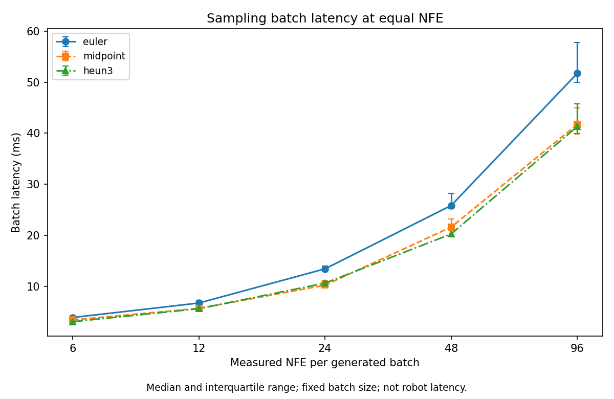
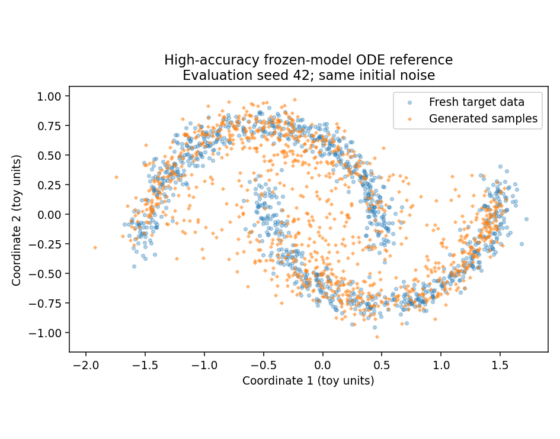

# 05 — Solver / NFE Ablation

Controlled study on **one** two-moons checkpoint: at a fixed number of velocity-network evaluations, how Euler, Midpoint, and Heun3 change ODE endpoint error, a sliced-Wasserstein diagnostic, and batch latency.

Tables: [`results/day5_summary.csv`](results/day5_summary.csv), [`results/day5_reference_checks.csv`](results/day5_reference_checks.csv), [`results/day5_per_seed.csv`](results/day5_per_seed.csv).  
Identity: [`results/day5_identity.json`](results/day5_identity.json).

---

## 1. Experiment identity

| Field | Value |
|---|---|
| Checkpoint SHA-256 | `9da3ab2bf6a2aa623da6d2d5ff056b2b0cd4de332df581c1d6d55f648ce6f189` |
| Training updates during this run | 0 |
| Weights unchanged after the run | true |
| Network | `VelocityMLP`, input `[x_t, t]` |
| Eval seeds | 42, 43, 44 |
| Points per seed | 1024 |
| Projection directions | 64 |
| Main dtype | float32, TF32 off |
| Reference | float64 Dopri5, `rtol = atol = 1e-9` (self-check also at `1e-7`) |
| Timing | 2 warmup, 5 repeats, CUDA synchronized, condition order shuffled |
| GPU | RTX 4060 Laptop |
| Package | `flow_matching` 1.0.10, `torchdiffeq` 0.2.5 |
| NFE counter matched the formula | true |
| Script SHA-256 | `2db2f656383bae02e561126f5a325d7dd11f24d919ac0f6259cc78b01fc6ccec` |

Seeds resample noise and target clouds. They are not three training runs. Timing repeats reuse the same inputs and only measure clock noise.

---

## 2. Hypothesis and controls

**Hypothesis:** a higher-order step can reach a given ODE accuracy with fewer intervals; whether that moves the two-moons distribution, or the wall time, has to be measured.

**Held fixed:** checkpoint, vector field, interval $[0, 1]$, per-seed noise and targets, batch size, dtype, projection directions, timing protocol.

**Independent variable:** method and interval count $K$, paired so NFE matches.

| NFE | Euler $K$ | Midpoint $K$ | Heun3 $K$ |
|---:|---:|---:|---:|
| 6 | 6 | 3 | 2 |
| 12 | 12 | 6 | 4 |
| 24 | 24 | 12 | 8 |
| 48 | 48 | 24 | 16 |
| 96 | 96 | 48 | 32 |

Euler $K = 1$ and $K = 100$ are diagnostic rows. $K = 100$ matches the training sampler’s step count but does not reuse those noise draws.

Equal NFE holds the number of batch forwards fixed. It does not hold every tensor op, Python loop, or cache effect fixed. A lower median time for Heun3 than for Euler at the same NFE is an observation on this machine. It is not a profiled explanation.

---

## 3. Two metrics

**ODE endpoint RMSE.** Same $x_0$, low-budget endpoint versus the frozen field’s high-accuracy endpoint:

$$
\mathrm{RMSE} = \sqrt{\mathrm{mean}_{i,d}\,(X_i^{(d)} - X_i^{\mathrm{ref}\,(d)})^2}
$$

The reference is not the two-moons data. Main results are float32 and the reference is float64, so RMSE mixes discretization with a dtype gap. The self-check RMSE between the `1e-7` and `1e-9` Dopri5 solutions is about $1.4\times 10^{-7}$. That is a stability diagnostic in the script (`reference_selfcheck_rmse < 1e-5` flags “stable”), not a proved global error bound.

**Empirical SWD2.** Project both clouds on the same random unit directions, sort each projection, then

$$
\mathrm{SWD2} = \sqrt{\mathrm{mean}_{\mathrm{dir},\,\mathrm{rank}}\,(\mathrm{sorted}(X u) - \mathrm{sorted}(Y u))^2}
$$

Sorting removes index pairing. Point $i$ of the sample is not matched to point $i$ of the data. This is a NumPy implementation of the equal-count, equal-weight case, not the POT library. 1024 points and 64 directions are a finite diagnostic.

---

## 4. Results

Displayed to 6 decimals (ODE, SWD) and 1 decimal (milliseconds). Exact cells are in [`day5_summary.csv`](results/day5_summary.csv). Means are over the three eval seeds. `std` in the CSV is the sample standard deviation across those seeds.

### Equal NFE

| Method | $K$ | NFE | ODE RMSE | SWD2 | median ms |
|---|---:|---:|---:|---:|---:|
| Euler | 6 | 6 | 0.121077 | 0.133682 | 3.9 |
| Midpoint | 3 | 6 | 0.038646 | 0.066855 | 3.4 |
| Heun3 | 2 | 6 | 0.024854 | 0.067328 | 3.1 |
| Euler | 12 | 12 | 0.060587 | 0.087673 | 6.7 |
| Midpoint | 6 | 12 | 0.007927 | 0.064817 | 5.7 |
| Heun3 | 4 | 12 | 0.003787 | 0.066151 | 5.6 |
| Euler | 24 | 24 | 0.030299 | 0.072698 | 13.4 |
| Midpoint | 12 | 24 | 0.001791 | 0.065498 | 10.2 |
| Heun3 | 8 | 24 | 0.000338 | 0.065768 | 10.6 |
| Euler | 48 | 48 | 0.015153 | 0.068151 | 25.8 |
| Midpoint | 24 | 48 | 0.000432 | 0.065683 | 21.6 |
| Heun3 | 16 | 48 | 0.000037 | 0.065745 | 20.2 |
| Euler | 96 | 96 | 0.007578 | 0.066675 | 51.7 |
| Midpoint | 48 | 96 | 0.000107 | 0.065729 | 41.7 |
| Heun3 | 32 | 96 | 0.000004 | 0.065743 | 41.3 |

### Diagnostic Euler

| $K$ | NFE | ODE RMSE | SWD2 | median ms |
|---:|---:|---:|---:|---:|
| 1 | 1 | 0.719585 | 0.650674 | 1.0 |
| 100 | 100 | 0.007275 | 0.066627 | 54.3 |

---

## 5. Reference checks

Equal-weight means of the three rows in [`day5_reference_checks.csv`](results/day5_reference_checks.csv):

| Quantity | Mean |
|---|---:|
| Reference-vs-target SWD2 | 0.0657432369302124 |
| Target-vs-target SWD2 | 0.046907074700664055 |
| Self-check RMSE | 1.388e-7 to 1.412e-7 (per seed, not averaged into one claim) |

Heun3 at NFE 96 has ODE RMSE $4.431\times 10^{-6}$ and SWD2 **0.065743**, in line with the reference-vs-target mean. Midpoint at NFE 12 has SWD2 **0.064817**, slightly **below** that reference score. A coarser solver can look better on a finite SWD by cancellation or sampling noise. That is why 0.065743 is not a theorem-style lower bound or a “model ceiling.”

Per-seed reference status is `stable_diagnostic` on all three seeds. Adaptive NFE of the reference itself (about 194–200 forwards at `1e-9`) is not an entry in the equal-NFE table and is not timed against the fixed solvers.

---

## 6. What the table supports

On this checkpoint and this protocol, Midpoint and Heun3 at NFE around 12–24 already sit near the high-accuracy ODE’s SWD2, while ODE RMSE keeps falling as NFE grows. Further exact integration of the current vector field is a weak lever on this distribution diagnostic.

Batch milliseconds are for 1024 points, including solver and Python overhead, excluding checkpoint load, host-device copy of inputs, the reference solve, metrics, and plotting. Dividing by 1024 is not a robot latency. These milliseconds are not comparable to Week 2 PushT `predict_action` times: different model, batch, task, and code path.

The run does not say which of capacity, step count, data noise, or coupling to change next. It only separates “integrate this field more carefully” from “the field’s samples are already near this SWD reference.”
