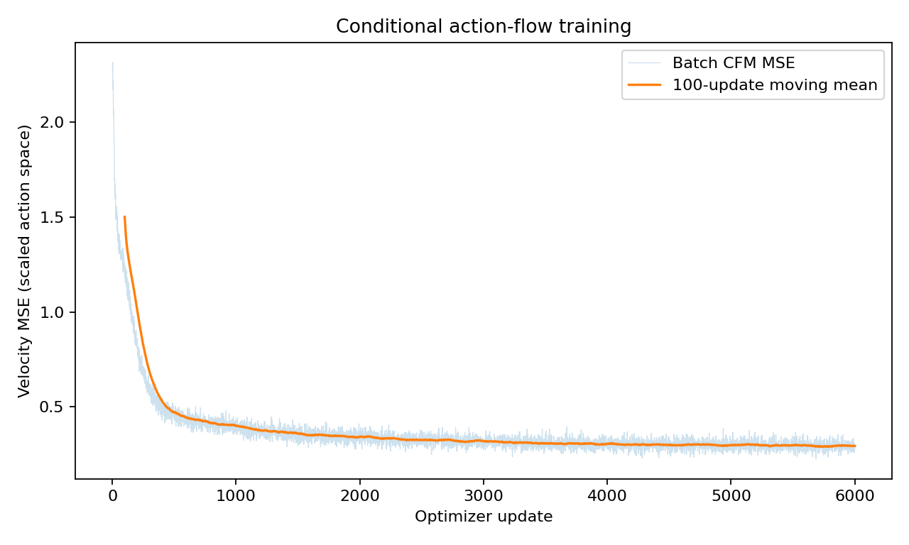
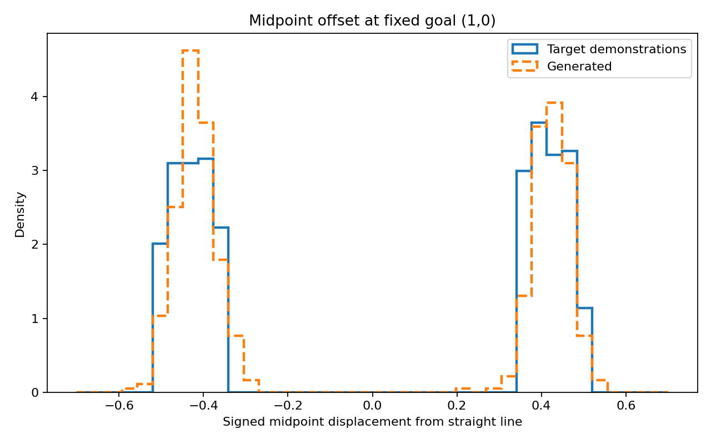

# 06 — Conditional Action Chunks

One newly trained model. Synthetic, open-loop, goal-conditioned relative displacements in 2-D. Not π₀, not PushT, not a robot.

Tables: [`results/day6_summary.csv`](results/day6_summary.csv), [`results/day6_mode_coverage.csv`](results/day6_mode_coverage.csv), [`results/day6_per_seed_metrics.csv`](results/day6_per_seed_metrics.csv).  
Identity: [`results/day6_identity.json`](results/day6_identity.json).

Model SHA-256 `c690234b069e1d514d64641ca1342da0e9a191ace350c59c04d9358492f09f8c`. The file is local only. This run did not load the two-moons checkpoint (`loaded_from` is null).

---

## 1. Task

Start at $(0, 0)$. Goals in training and evaluation are drawn from $g_x \sim U(0.6, 1.6)$, $g_y \sim U(-1, 1)$. The condition vector is $(g_x, g_y)$ itself.

Demonstrations use the bend formula in [02_FM_Architecture.md](02_FM_Architecture.md). Half the demos bend each way. The sign is not an input, so one goal has two valid path families. Online sampling uses the same generator; evaluation uses separate RNG streams. That is still the design distribution, not a real-robot or out-of-distribution test.

| Tensor | Shape | Role |
|---|---|---|
| raw actions | `[B, 16, 2]` | relative displacements |
| $x_1$ | `[B, 16, 2]` | $16\times$ raw actions |
| $x_0$, $x_\tau$, velocity | `[B, 16, 2]` | noise, interpolated chunk, $x_1-x_0$ |
| condition | `[B, 2]` | goal |
| decoded positions | `[B, 17, 2]` | prefix sum of raw actions, origin included |

The scale $H = 16$ is a constant. It is not fit on the eval set, and it is not an endpoint correction.

---

## 2. Training

| Item | Value |
|---|---|
| Backend | official `AffineProbPath(CondOTScheduler())` |
| Steps | 6000 |
| Batch | 256 |
| Hidden | 128, three SiLU layers |
| Optimizer | Adam, lr $10^{-3}$ |
| LR schedule | cosine to $10^{-4}$ (`eta_min = 0.1 × lr`) |
| Train seed | 42 |
| Device | CUDA, RTX 4060 Laptop |
| Sampler at eval | Midpoint, 32 intervals, NFE 64 |

The cosine schedule is `torch.optim.lr_scheduler.CosineAnnealingLR`. It is a different object from `CondOTScheduler`.

Validation CFM MSE on a batch of **2048** drawn once before the loop:

| | MSE |
|---|---:|
| Before | 2.285278081893921 |
| After | 0.2994152903556824 |

Midpoint with 32 intervals is the script default for this chunk model. It was not selected by the solver sweep. The two-moons network cannot run this task: ranks differ.

---

## 3. Condition intervention

Same weights, same noise, two condition batches. The second batch is `goals.roll(1)` along the batch axis: a cyclic shift, still inside the sampled goal set, so the control is not an all-zero vector.

| Test | Endpoint compared with | Mean error | SD over 3 eval seeds |
|---|---|---:|---:|
| `correct_goal` | requested goal | 0.036374459664026894 | 0.0014912460881475287 |
| `permuted_vs_requested` | original requested goal | 0.8067576090494791 | 0.02132020413302889 |
| `permuted_vs_supplied` | goal actually passed in | 0.03622422367334366 | 0.0013247840226065218 |

$$
0.8067576090494791 / 0.036374459664026894 = 22.179
$$

Eval seeds are 101, 102, 103. Each seed mean uses 512 samples. The SD is the sample standard deviation of the three seed means (`ddof = 1`), not a confidence interval and not a training-seed uncertainty.

Reading the three numbers together: after the shift, error against the **old** goal jumps, and error against the **new** goal returns to the unshifted level. The outputs moved with the input. A lone increase against the old goal would also be explained by “the model collapsed when the condition changed.”

This does not compare a conditional training run to an unconditional training run. No causal-effect estimator is claimed.

---

## 4. Two modes at a fixed goal

Goal fixed at $(1, 0)$, 512 samples per eval seed. The midpoint of the position sequence is index $16/2 = 8$. For this goal the geometric normal is $(0, 1)$, so the signed offset used in the file is the $y$ coordinate. Thresholds $\pm 0.15$ label positive, negative, and near-straight. They are a diagnostic, not a safety margin.

Equal-weight means of the three seeds in [`day6_mode_coverage.csv`](results/day6_mode_coverage.csv):

| | Generated | Demonstrations |
|---|---:|---:|
| Positive fraction | 0.474609375 (47.46%) | 0.498697917 (49.87%) |
| Negative fraction | 0.524739583 (52.47%) | 0.501302083 (50.13%) |
| Near-straight fraction | 0.000651042 (0.065%) | 0 |
| Mean absolute midpoint offset | 0.418710728 | 0.423964431 |

The only near-straight generated count is seed 103: $1/512 = 0.001953125$. Demonstration endpoints at this goal have error 0 because `make_demonstrations` writes $g$ onto the last point. Generated endpoint errors on this fixed goal are about 0.033 on each seed (see the CSV), which is a different draw from the random-goal row in Section 3.

Both bends are present. That does not calibrate the full 32-dimensional conditional law, and it does not test every goal. Three eval seeds cannot support a statement about training variance.

---

## 5. Boundary

The conditional model trains with $c$ in the features, samples with $c$ held fixed along the ODE, and decodes an open-loop sum of toy displacements. Real control time — how long one action runs, when the policy is queried again — is not defined in this generator.
