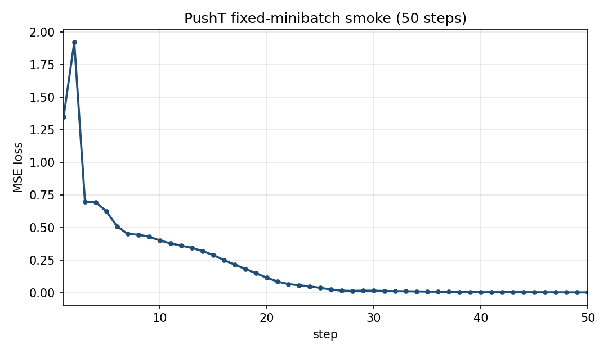
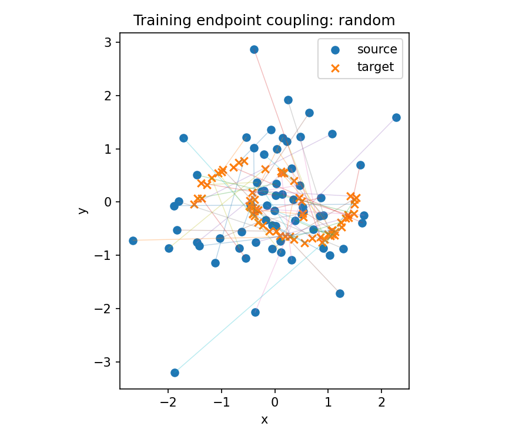
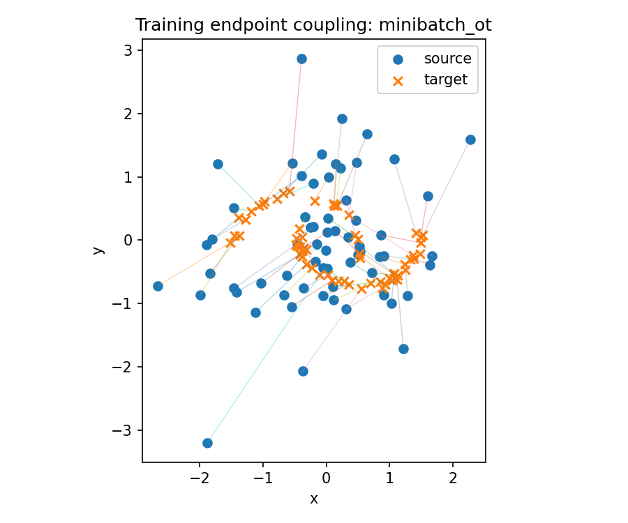

# 07 — Coupling and Image-Conditioned Actions

Two supplements on the same velocity-regression interface. They do not replace the two-moons solver study or the synthetic goal-chunk model.

Numbers: [`results/otcfm_aggregate.csv`](results/otcfm_aggregate.csv), [`results/otcfm_summary.csv`](results/otcfm_summary.csv), [`results/pusht_overfit.json`](results/pusht_overfit.json), [`results/pusht_rollout.csv`](results/pusht_rollout.csv).  
Identity: [`results/otcfm_identity.json`](results/otcfm_identity.json), [`results/pusht_identity.json`](results/pusht_identity.json).

Machine: Windows, RTX 4060 Laptop, Python 3.10.21, PyTorch 2.1.2+cu121. The pairing study uses **TorchCFM 1.0.7**. The PushT runs load the HRI image-based example at commit `516e8e18875b27741bdbdb8a252e904032c90723`. Upstream trees and the official `.pth` stay on the author machine.

---

## 1. Two different uses of the word “condition”

| | Observation condition | Endpoint coupling |
|---|---|---|
| Question | Under which image and agent pose should an action chunk be generated? | Which noise sample is tied to which clean sample when the path is built? |
| This note | PushT: ResNet18 feature (512) plus agent position (2) → `[B, 514]` | Independent Gaussian draw, or a minibatch OT plan |
| Enters the network as | extra input beside $(x_\tau, \tau)$ | not an input; it changes the training pairs $(x_0, x_1)$ |

Both still use the linear path $x_\tau = (1-\tau)x_0 + \tau x_1$ and the label $x_1 - x_0$. Minibatch OT does not replace that formula. It changes **who is paired with whom**, so the conditional velocities the network must fit are less spread out. A single conditional path is already a straight line. The integrated marginal field can still bend.

Minibatch OT is a transport plan on one finite batch. It is not optimal transport of the full data distribution, and it is not the CondOT scheduler ($\alpha(\tau)=\tau$, $\sigma(\tau)=1-\tau$) used earlier.

---

## 2. Image-conditioned PushT interface

Public `flow_pusht.py` is an image benchmark. It is not the paper’s full language-to-affordance pipeline (Affordance-based Robot Manipulation with Flow Matching, [arXiv:2409.01083v5](https://arxiv.org/html/2409.01083v5), Section III-B). The network predicts a velocity. The name `noise_pred_net` in the example is only a variable name.

| Tensor | Shape | Meaning |
|---|---|---|
| image | `[B, 3, 96, 96]` | one RGB frame |
| agent position | `[B, 2]` | normalized pusher position |
| observation condition | `[B, 514]` | 512-D ResNet18 feature + 2-D position |
| $x_1, x_0, x_\tau$, velocity | `[B, 16, 2]` | action chunk, noise, interpolant, label and prediction |

The 16 is the prediction horizon. NFE is how many times the velocity net is evaluated along flow time. The policy predicts 16 pusher-position targets and executes the first 8, then reads a new observation. $v_\theta$ is the rate of change of the action chunk in flow time, not the pusher’s physical speed.

Data: the same PushT image zarr as the Week 2 checkout. 25650 frames, 206 episodes, 24002 eligible windows. Images are float32 in 0–255 and scaled with `float_0_255_to_0_1`. Normalization is min/max over all demonstrations, not a held-out split.

A forward-only shape check (random tensors, no backward) counts **83,755,074** parameters and NFE 1.

The learning check is a **fixed minibatch overfit**: two real windows (starts 2270 and 19872), fixed $x_0$ and $\tau$, AdamW, 50 steps, batch 2, sample NFE 4.

| Record | Value |
|---|---:|
| Train-mode loss at step 1, before the update | 1.3473950624465942 |
| Train-mode loss on row 50 of `loss.csv`, before that update | 0.0012080917367711663 |
| Eval-mode loss on the same batch after 50 updates | 0.0010173895861953497 |

Gradients were finite and the generated chunk had shape `[2, 16, 2]`. No deployment checkpoint was saved. This is not a PushT success rate.

---

## 3. Independent CFM versus minibatch OT-CFM

Unconditional noisy two-moons. Three training seeds (0, 1, 2). 2000 steps, batch 128, hidden width 128, Adam lr $10^{-3}$. Evaluation: 1024 points, Euler NFE $\in \{1,2,4,8,16,32\}$, RK4 reference with 128 steps.

Within a seed, initial weights, the raw $(x_0, x_1, \tau)$ draws, the optimizer, the evaluation noise, the target cloud, and the SWD directions are paired. The only change is the matcher: `ConditionalFlowMatcher(sigma=0)` versus `ExactOptimalTransportConditionalFlowMatcher(sigma=0)`.

A separate batch of 64 endpoints, squared Euclidean cost ([`otcfm_pairing.json`](results/otcfm_pairing.json)):

| Pairing | Cost |
|---|---:|
| One random pairing | 3.355153 |
| Expected cost of the independent plan | 3.001203 |
| Minibatch OT plan | 0.771786 |

Those drawings are endpoint links **before** training. A cheaper plan is not, by itself, a better generative model.

SWD2 compares generated clouds to target samples. RMSE compares a cheap Euler endpoint to **that same model’s** RK4 reference. Means $\pm$ sample standard deviation over the three seeds (`ddof = 1`), from [`otcfm_aggregate.csv`](results/otcfm_aggregate.csv):

| NFE | CFM SWD2 | OT-CFM SWD2 | CFM vs own RK4 | OT-CFM vs own RK4 |
|---:|---:|---:|---:|---:|
| 1 | 0.602558 ± 0.008410 | 0.077485 ± 0.004690 | 0.799464 ± 0.038386 | 0.090692 ± 0.006441 |
| 2 | 0.373831 ± 0.010632 | 0.061401 ± 0.003632 | 0.377009 ± 0.015188 | 0.046208 ± 0.001891 |
| 4 | 0.186637 ± 0.021426 | 0.061777 ± 0.004488 | 0.182347 ± 0.005463 | 0.022159 ± 0.000563 |
| 8 | 0.112081 ± 0.020096 | 0.064011 ± 0.004732 | 0.089939 ± 0.002583 | 0.010128 ± 0.000207 |
| 16 | 0.092631 ± 0.012871 | 0.065373 ± 0.004896 | 0.044731 ± 0.001268 | 0.004905 ± 0.000090 |
| 32 | 0.090685 ± 0.006932 | 0.066102 ± 0.004988 | 0.022316 ± 0.000630 | 0.002420 ± 0.000044 |

RK4 self-check gaps (128 vs 64 steps) across the six trained models lie between **1.828e-7** and **2.041e-7**.

Reference path length divided by displacement, one number per seed: CFM **1.764, 1.688, 1.612**; OT-CFM **1.003, 1.003, 1.004**. OT-CFM’s reference trajectories are nearly straight, so Euler at NFE 1–4 already sits close to its own fine integral. CFM’s trajectories are longer; its SWD2 at NFE 32 is still about **0.091**, above OT-CFM at NFE 2 (**0.061**).

OT-CFM SWD2 is lowest at NFE 2 and rises by about 0.005 through NFE 32, on the order of the seed standard deviation. The supported statement is that OT-CFM reaches its plateau at very small NFE. The rise is not a finding that more steps make this model worse.

Training wall time, including OT pairing: CFM **7.40 ± 2.62 s**, OT-CFM **13.43 ± 3.46 s** (about **1.82×**). Seed 0 differs by only **1.76 s**; seed 2’s OT-CFM run is **17.35 s**. Sampling milliseconds have seed scatter comparable to the mean, so they are not used as a speed ranking. Training loss is not a ranking either: a new coupling changes the label distribution.

---

## 4. Official-weight simulation

Checkpoint SHA-256 `a4e16aebb2bcddc32846109dd7bd61a88d9f31bd0791357e76268958b5bd1096`. Source noise is Gaussian. The public test script draws uniform noise; this run records that difference instead of treating the two as the same protocol. Three episodes, 300 environment steps, NFE 4.

| Env seed | Max reward | Last reward | Terminated / truncated |
|---:|---:|---:|---|
| 1000 | 0.302894 | 0.046521 | no / no |
| 1001 | 0.000000 | 0.000000 | no / no |
| 1002 | 0.185490 | 0.000000 | no / no |

Clips: [`results/pusht_rollouts/`](results/pusht_rollouts/). Max reward is the highest coverage seen in that episode. It is not a success rate, and three episodes are not the paper benchmark. The policy is image-based. Week 2’s Diffusion Policy run was low-dimensional. The two are not a head-to-head.

---

## 5. What this supports

On this 2-D setup, minibatch OT lowers endpoint transport cost, the learned reference trajectories are straighter, and equal-NFE SWD2 and deviation from each model’s own RK4 are lower than independent CFM. The gap is largest at NFE 1–4. Mean training time is longer.

On PushT, the observation-conditioned chunk interface runs on real image demonstrations, and a 50-step fixed batch can drive the velocity loss from about 1.35 to about 0.001. An official checkpoint can be rolled out in simulation; one of the three episodes stays at reward 0.

---

## 6. What this does not support

- Treating the 50-step overfit as a PushT policy.
- Treating three episodes as the HRI success-rate table.
- Reading the pairing figure as a distribution-quality result.
- Reading a smaller RMSE-to-own-RK4 as a stronger policy. That column asks whether a coarse integral tracked that model’s own fine integral.
- Equating minibatch OT with global OT or with the CondOT path.
- Swapping an OT matcher into an observation-conditioned training loop. OT reorders or resamples $x_1$; the observation tied to that action has to move with it, and the noise–action coupling **given the observation** still needs its own check. That check was not run. The pairing result stops at the unconditional 2-D problem.
- Claiming Flow Matching is faster or more accurate than Week 2’s Diffusion Policy.
