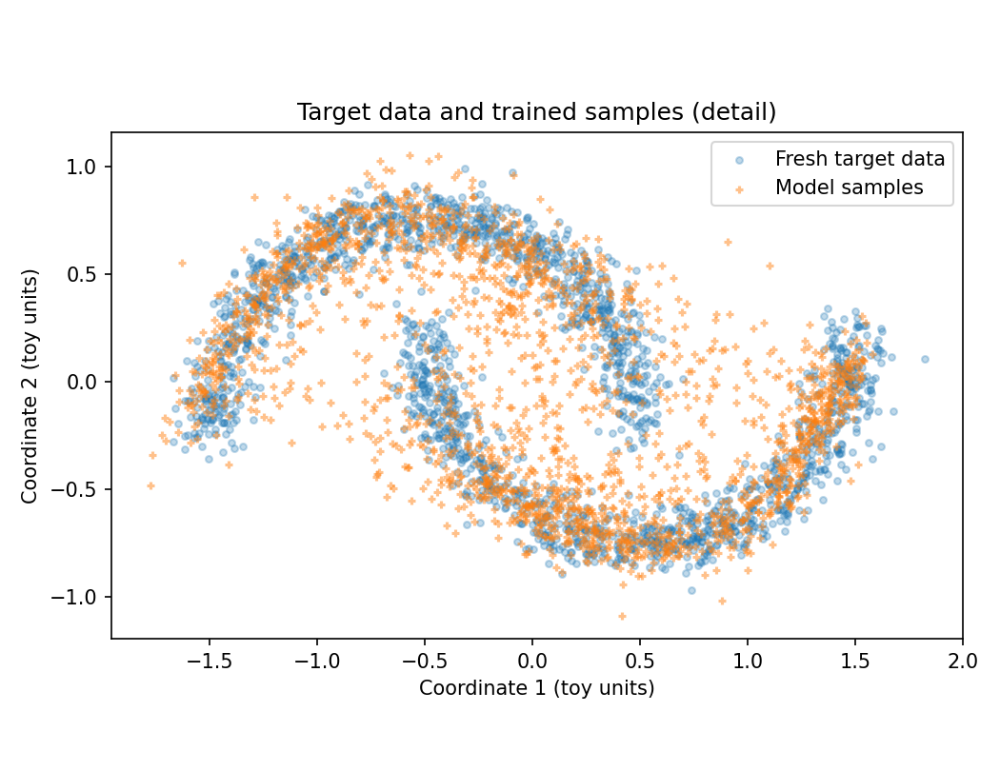
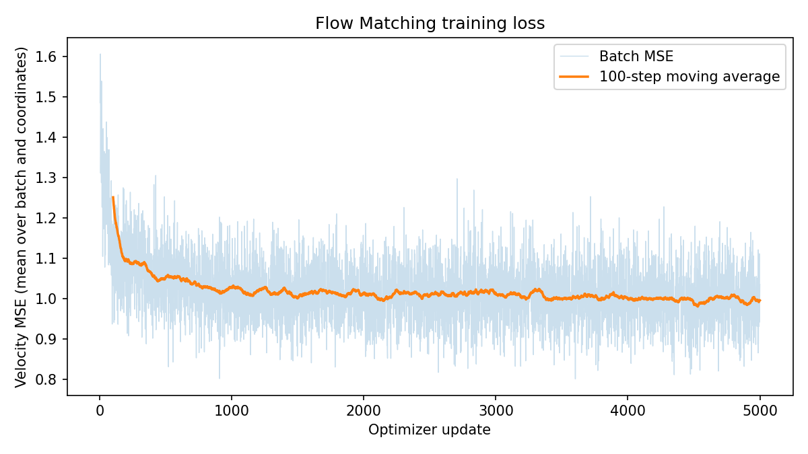
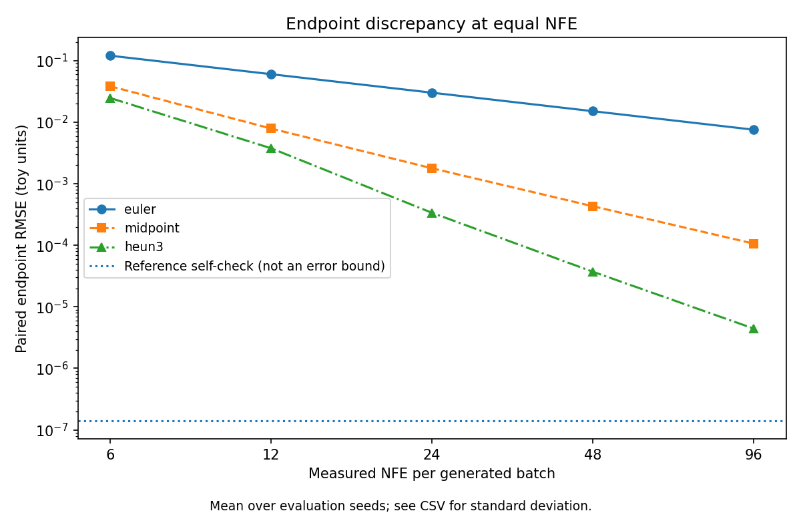
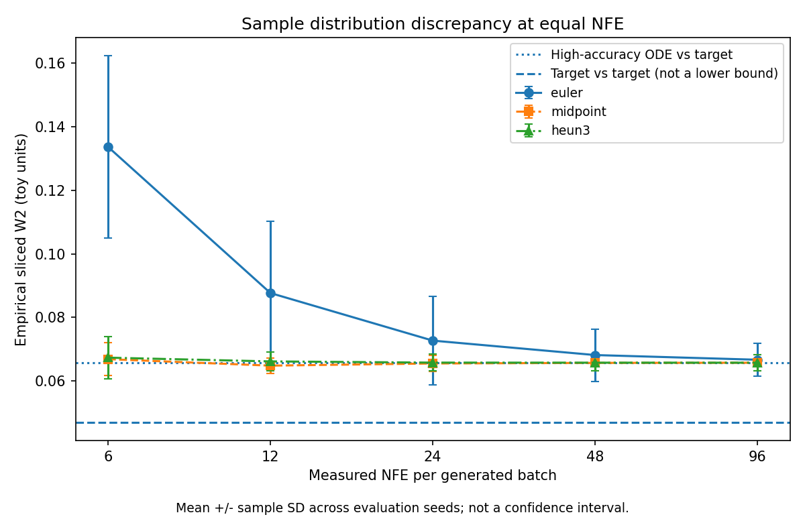
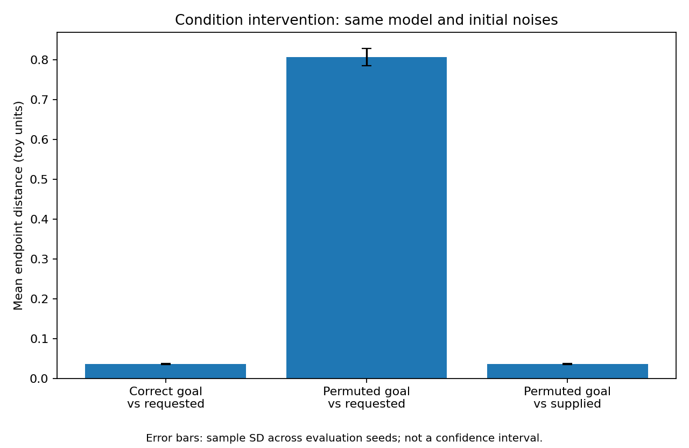
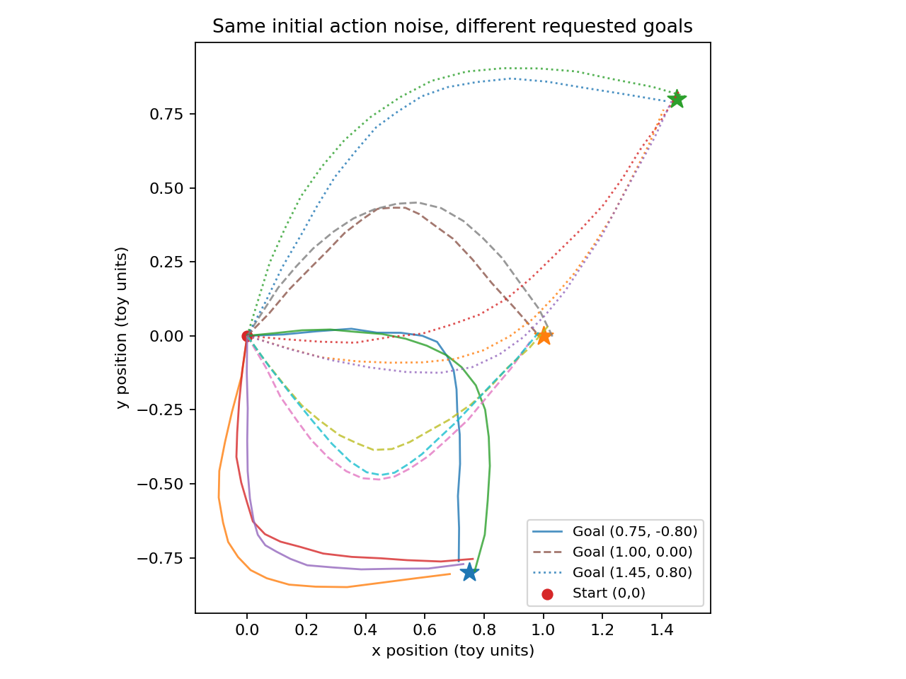
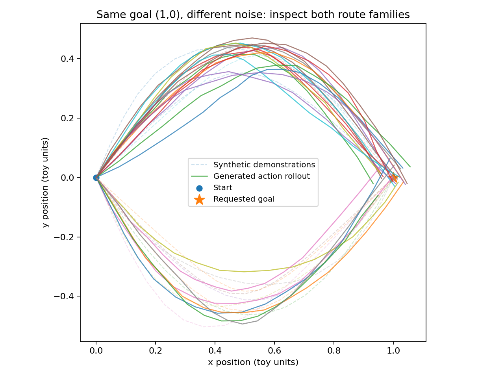
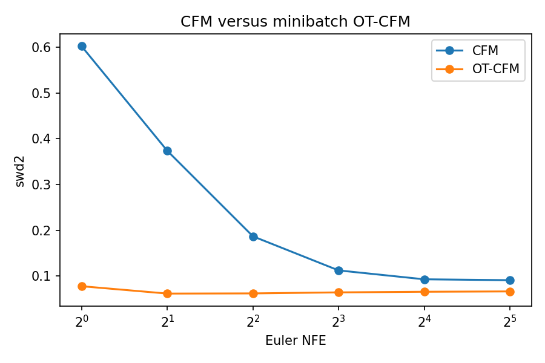

# Week 3 — Flow Matching

Research note for VLA Roadmap Week 3. Numbers come from a local two-moons Flow Matching run, an official-API consistency check on that checkpoint, a fixed-checkpoint ODE solver / NFE study, one goal-conditioned action-chunk model, and a later pairing-plus-image-interface supplement (copies under [`results/`](results/)). This is **not** a robot-policy benchmark and **not** a rerun of the official `examples/2d_flow_matching.ipynb`.

**Detail docs:** [01 Paper](01_FM_Paper.md) · [02 Architecture](02_FM_Architecture.md) · [03 Code Map](03_FM_Code_Map.md) · [04 Reproduction](04_Reproduction.md) · [05 Solver / NFE](05_Solver_NFE_Ablation.md) · [06 Conditional Actions](06_Conditional_Action.md) · [07 Coupling and Observation](07_Coupling_and_Observation.md) · [Source Index](results/SOURCE_INDEX.md)

Chinese week conclusion: [`results/CONCLUSION_zh.md`](results/CONCLUSION_zh.md).

---

## 1. Goal

- Connect Week 1–2 leftovers (multimodal chunks, noise-prediction sampling, inference compute) to **conditional flow matching**: regress a path velocity, then integrate an ODE.
- Hand-check the linear path and the CFM loss, then train an unconditional 2-D velocity MLP on two-moons.
- Show that Meta `flow_matching` 1.0.10 (`CondOTScheduler`, `AffineProbPath`, `ODESolver`) matches that hand-written path and Euler step on the **same** checkpoint.
- On that frozen checkpoint, compare Euler / Midpoint / Heun3 at equal network evaluations.
- Train a separate goal-conditioned model that generates a length-16 2-D action chunk.
- Compare independent pairing with minibatch OT on a new two-moons pair of models, and check an image-conditioned PushT velocity interface on real demonstration windows.

π₀ / OpenPI source reading is **deferred**. It is not part of this note.

---

## 2. Problem Formulation

**Single-step BC:**

$$
\pi(a_t \mid o_t)
$$

**ACT:** action chunk + CVAE. Train encodes $(q, a_{t:t+k})$ into $z$; inference decodes with $z = 0$.

**Diffusion Policy (noise prediction, Week 2):**

$$
\mathcal{L}_\epsilon = \mathbb{E}\,\|\epsilon_\theta(A^{(k)}, k, O) - \epsilon\|^2
$$

**Flow Matching (this week).** Generation time $\tau = 0$ is noise and $\tau = 1$ is data. With an independent coupling and the conditional OT path:

$$
x_\tau = (1-\tau)\,x_0 + \tau\,x_1, \qquad u = x_1 - x_0
$$

$$
\mathcal{L}(\theta) = \mathbb{E}\,\|v_\theta(x_\tau, \tau, c) - (x_1 - x_0)\|^2
$$

Sampling does not see $x_1$:

$$
X_0 \sim \mathcal{N}(0, I), \qquad \frac{dX_\tau}{d\tau} = v_\theta(X_\tau, \tau, c)
$$

| Symbol | Meaning this week |
|---|---|
| $x_1$ | clean sample: a 2-D point, or a scaled action chunk `[B, 16, 2]` |
| $x_0$ | independent standard Gaussian of the same shape |
| $\tau$ | flow time in $[0, 1]$; one time per sample or per chunk |
| $c$ | absent on two-moons; for action chunks, the goal $(g_x, g_y)$ |
| NFE | number of velocity-network forwards on the whole batch |

`optimizer.step()` updates $\theta$. An Euler / Midpoint / Heun step updates $X$. One training update draws a single $\tau$; it does not integrate a trajectory.

---

## 3. Why Flow Matching After Diffusion Policy

Week 2 learned a conditional generative model over action chunks by predicting noise. Flow matching keeps the “sample a chunk from noise” interface and changes the training target to a **path velocity**.

| | ACT | Diffusion Policy (noise prediction) | This week’s conditional FM |
|---|---|---|---|
| Object | action chunk | action chunk | action chunk |
| Training target | reconstruction + KL | noise MSE | velocity MSE $x_1 - x_0$ |
| Inference | decode with $z = 0$ | iterative denoising | integrate $dX/d\tau = v_\theta$ |
| Clean action at sample time | not an input | not an input | not an input |

The ideal MSE velocity is the conditional expectation $\mathbb{E}[x_1 - x_0 \mid x_\tau, \tau, c]$, not the average of all demonstrated actions. Conditional variance is why the CFM loss need not go to zero.

Do not rename a noise-prediction target to “velocity” and call the algorithm migrated. DDIM can be deterministic; this week’s ODE is deterministic given $(X_0, c)$, and different $X_0$ still yields different samples. An action chunk is also not the same thing as open-loop execution of the whole chunk (Week 2 splits prediction length and execution length).



---

## 4. Architecture

**Unconditional two-moons**

```
x1 ~ two moons,  x0 ~ N(0, I),  τ ~ U(0, 1)
xt = (1-τ) x0 + τ x1
target = x1 - x0
v = MLP([xt, τ])          # input 3, three SiLU hidden layers of width 128, output 2
loss = MSE(v, target)

Inference: X ← X + Δτ · v_θ(X, τ)     # no x1 argument
```

**Goal-conditioned chunk**

```
condition c = goal ∈ R^2
x1 = H * raw_displacements,  H = 16,  shape [B, 16, 2]
v = MLP(flatten(xt), τ, c)   # 35 → 128 × 3 SiLU → 32, reshape [B, 16, 2]
positions = cumsum(x_generated / H) from (0, 0)    # [B, 17, 2]
```

`CondOTScheduler` sets $\alpha(\tau)=\tau$, $\sigma(\tau)=1-\tau$. `path.dx_t` is the supervision label, not the network output, and it is not an optimizer learning-rate scheduler. Details: [02_FM_Architecture.md](02_FM_Architecture.md).

---

## 5. Code Map

```
formula check     two hand samples → MSE → backward
two-moons train   make_training_batch → VelocityMLP → train_model → sample_euler
API check         AffineProbPath.sample  vs  handwritten xt, dx
                  ODESolver.sample(method="euler")  vs  handwritten Euler
solver study      ODESolver + CountingVelocity     # Euler / Midpoint / Heun3, equal NFE
conditional chunk make_demonstrations → ConditionalVelocityMLP
                  → official path sample → sample_actions(condition=goal)
```

The official library is [facebookresearch/flow_matching](https://github.com/facebookresearch/flow_matching) (installed package **1.0.10**). This note does not vendor that tree. Full map: [03_FM_Code_Map.md](03_FM_Code_Map.md).

---

## 6. Reproduction

Task: unconditional **two-moons**, `data_noise = 0.08`. Machine: Windows, RTX 4060 Laptop, Python 3.10.21, PyTorch 2.1.2+cu121, NumPy 1.26.4. Seed **42**, **5000** Adam steps, batch **256**, lr **1e-3**, hidden **128**. Sampling: **100** Euler steps, **2000** points. Checkpoint SHA-256 `9da3ab2b…f189` (full hash in [SOURCE_INDEX](results/SOURCE_INDEX.md)).

| Quantity | Value |
|---|---|
| Fixed validation CFM MSE, before → after | **1.516425 → 1.001853** (4096 points) |
| Mean train loss, first 100 → last 100 steps | **1.250594 → 0.995415** |
| Same-grid handwritten Euler vs official Euler | max abs diff **0** |
| Official Euler vs constant-$\Delta\tau$ Euler | endpoint max abs diff **1.550e-6** |

Calling the API does not retrain the moons, and it does not rerun the official notebook. The provider CPU reference run (PyTorch 2.10.0+cpu) is a different process; its validation MSE (1.546 → 1.011) is **not** the checkpoint used below.



Full write-up: [04_Reproduction.md](04_Reproduction.md).

---

## 7. Solver / NFE Ablation

**Fixed:** the two-moons checkpoint, architecture, interval $[0, 1]$, eval seeds `42, 43, 44`, 1024 points per seed, 64 projection directions, float32, CUDA-synced batch wall time. **No** training step.

**Independent variable:** solver and step count $K$, matched so each cell uses the same NFE. Euler uses 1 evaluation per step, Midpoint 2, Heun3 3. Heun3 here is the three-evaluation method, not `heun2` or `adaptive_heun`.

ODE RMSE compares endpoints to a float64 Dopri5 reference of the **same** vector field (`rtol = atol = 1e-9`). SWD2 is a 64-direction empirical sliced $W_2$ against two-moons samples. They answer different questions.

| Method | $K$ | NFE | ODE RMSE mean | SWD2 mean | median batch ms |
|---|---:|---:|---:|---:|---:|
| Euler | 24 | 24 | 0.030299 | 0.072698 | 13.4 |
| Midpoint | 12 | 24 | 0.001791 | 0.065498 | 10.2 |
| Heun3 | 8 | 24 | 0.000338 | 0.065768 | 10.6 |

Equal-weight mean of the three reference-vs-target SWD2 values: **0.065743**. Target-vs-target SWD2 mean: **0.046907**. Reference self-check RMSE is about **1.39e-7 to 1.41e-7**.

On this checkpoint, higher-order steps cut ODE endpoint error much faster than they move SWD2. SWD2 near 0.0657 is this protocol’s high-accuracy ODE reference score, not a proved model ceiling. Seeds are evaluation seeds of **one** training run.





Full table: [05_Solver_NFE_Ablation.md](05_Solver_NFE_Ablation.md).

---

## 8. Conditional Action Chunks

New model. Synthetic open-loop task: start at $(0,0)$, goal $g_x \sim U(0.6, 1.6)$, $g_y \sim U(-1, 1)$, generate 16 relative displacements. Two bend signs exist in the data and are **not** model inputs. Backend: official `AffineProbPath`. Sampler: Midpoint, $K = 32$, NFE $= 64$. Train seed **42**, 6000 steps. Eval seeds **101–103**, 512 samples each, are sampling seeds of this one model.

Validation CFM MSE on a fixed 2048-example batch: **2.285278 → 0.299415**.

| Intervention | Compared with | Mean endpoint error |
|---|---|---:|
| Correct goal | requested goal | **0.036374** |
| Cyclic goal shift | original requested goal | **0.806758** |
| Same shifted output | the goal actually fed in | **0.036224** |





The second error is about **22.18×** the first. The third returns to the first. The trajectory plot uses one shared noise batch and three requested goals (the stars). Together they support “the output follows the supplied goal,” which is stronger than “scrambling the condition breaks the model.” It is an input intervention on one conditional model, not a retrained unconditional baseline.

At the fixed goal $(1, 0)$, both bend directions appear (positive midpoint share **47.46%** generated vs **49.87%** in demonstrations). Endpoint units are toy coordinates, not meters and not a success rate. This synthetic model has no images, language, contact, or closed-loop control.



Full write-up: [06_Conditional_Action.md](06_Conditional_Action.md).

---

## 9. Coupling and an Image-Conditioned Interface

Two supplements. They keep the linear path $x_\tau=(1-\tau)x_0+\tau x_1$ and the label $x_1-x_0$.

**Image-conditioned PushT.** The public HRI example (commit `516e8e18`) feeds a 512-D ResNet feature plus 2-D agent position into a velocity U-Net. The action chunk is `[B, 16, 2]`; inference builds 16 targets and executes 8. On two fixed real windows, 50 AdamW steps take the train-mode loss from **1.347** to **0.001208**, and the eval-mode loss on that same batch is **0.001017**. That is a fixed-batch overfit, not a PushT policy. An official checkpoint (SHA-256 `a4e16aeb…1096`), Gaussian source noise, NFE 4, three episodes of 300 steps: max rewards **0.303, 0.000, 0.185**. Those are not a success rate and not a comparison with Week 2’s low-dimensional Diffusion Policy.

**Pairing.** TorchCFM 1.0.7, three training seeds, 2000 steps. Within a seed only the endpoint coupling changes. Minibatch OT transport cost on a 64-point diagnostic batch is **0.772**, against **3.355** for one random pairing.

| NFE | CFM SWD2 | OT-CFM SWD2 |
|---:|---:|---:|
| 1 | 0.603 ± 0.008 | 0.077 ± 0.005 |
| 4 | 0.187 ± 0.021 | 0.062 ± 0.004 |
| 32 | 0.091 ± 0.007 | 0.066 ± 0.005 |

OT-CFM reference trajectories are nearly straight (path length / displacement ≈ **1.00**). Independent CFM stays near **1.61–1.76**. Mean training time is about **1.82×** longer once OT pairing is included. The OT result is unconditional and 2-D. The matcher was not dropped into the image-conditioned training loop.



Full write-up: [07_Coupling_and_Observation.md](07_Coupling_and_Observation.md).

---

## 10. Main Findings

1. **Training updates $\theta$ with a velocity label built from $x_1$; sampling updates $X$ and does not receive $x_1$.**
2. On the local two-moons run, CFM validation MSE fell from **1.516** to **1.002** and stayed near 1. That is expected under conditional regression variance; it is not a distribution distance.
3. **Handwritten CondOT interpolation and Euler match `flow_matching` 1.0.10** on this checkpoint (same-grid max abs diff 0). Agreement is an implementation check, not a better generative model.
4. **ODE accuracy and sample-distribution quality are different measurements.** At equal NFE, Midpoint and Heun3 reduce endpoint RMSE by orders of magnitude while SWD2 sits near the high-accuracy ODE reference.
5. **The chunk model uses its goal input.** A cyclic condition shift moves the endpoint to the new goal (error 0.0362) instead of the old one (error 0.8068), and both bend modes remain at $(1, 0)$.
6. **Endpoint coupling changes low-NFE behavior.** On a paired two-moons comparison, minibatch OT-CFM reaches SWD2 ≈ 0.06 by NFE 2–4, while independent CFM is still near 0.19 at NFE 4. Training time is longer.
7. **An image can enter $v_\theta$ as a condition without turning the exercise into a robot benchmark.** The PushT interface matches `[B, 16, 2]` chunks and a 514-D condition; the 50-step loss drop is a fixed minibatch.

---

## 11. What This Week Leaves Open

1. Language conditions, and the π₀ / OpenPI reading that was deferred. The PushT image path is an interface check plus a fixed-batch overfit.
2. A matched flow-versus-diffusion comparison on the same PushT protocol. Week 2 was low-dimensional; the rollout here is image-based and three episodes long.
3. Whether minibatch OT still helps once the observation is tied to the action. The pairing result is unconditional and 2-D.
4. Closed-loop contact and real time. The synthetic chunk model only accumulates toy displacements.
5. Capacity and data when SWD2 stalls on the original frozen two-moons field. Coupling was measured on a new pair of models, not on that checkpoint.

---

## Artifact locations

| Content | Where |
|---|---|
| Two-moons checkpoint `flow_matching_day3.pt` | local `Week3_Day3/outputs/day3/` (SHA-256 in [SOURCE_INDEX](results/SOURCE_INDEX.md)) |
| API check | local `Week3_Day4/outputs/day4/`; numeric extract in [`results/day4_checks.json`](results/day4_checks.json) |
| Solver run | local `Week3_Day5/outputs/day5/`; tables in [`results/`](results/) |
| Conditional model | local `Week3_Day6/outputs/day6/`; tables in [`results/`](results/) |
| Pairing study and PushT interface | local `Week3_Day8/outputs/`; tables in [`results/`](results/) |
| Official libraries | `flow_matching` 1.0.10 for the earlier runs; TorchCFM 1.0.7 for the pairing study |
| This note | `Week03_Flow_Matching/` |

**Checkpoints, the PushT `.pth`, `.npz` sample dumps, upstream source trees, and the two-moons notebook are not in this GitHub note.**
